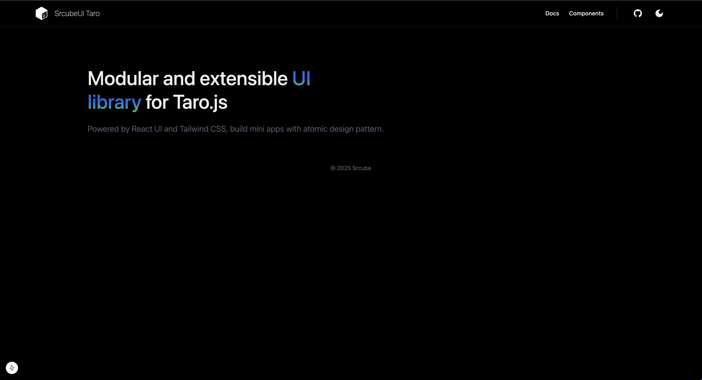
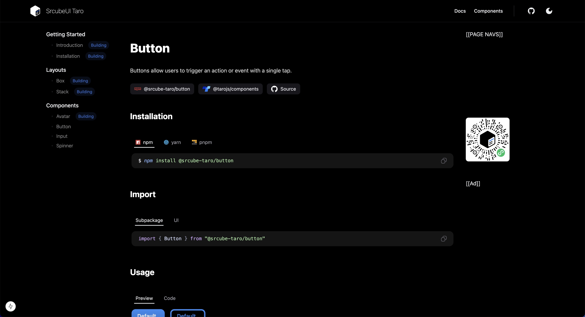

# Srcube Taro UI

A React component library for Taro.js applications with TailwindCSS support.

## Features

- 🎨 Built with TailwindCSS and Tailwind Variants
- 📦 Monorepo architecture with pnpm workspaces
- 🔧 Powered by Moon build system
- 🎯 TypeScript support
- 📱 Cross-platform components for mini-programs

## Tech Stack

- Moon Build System

- Taro.js
- React 18
- TailwindCSS
- Tailwind Variants
- TypeScript

## Project Structure

```
srcube-taro/
├── apps/
│   └── sample/                 # Demo application
├── packages/
│   ├── core/
│   │   ├── ui/                 # Main UI package
│   │   └── plugins/            # TailwindCSS plugins
│   ├── ui/                     # UI components
│   │   ├── [component]/
│   └── utils/                  # Shared utilities
│       └── [util]/
└── envs/                       # Shared configurations
    └── [config]/
```

## Getting Started

### Prerequisites

- Moon >= 1.0.0
- Node.js >= 18.20.5
- pnpm >= 9.15.1

### Installation

Install dependencies

```bash
pnpm install
```

### Development

```bash
moon sample:dev-weapp
```

### Build

```bash
moon :build
```

### Component Structure

Each component follows a consistent structure:

```
packages/ui/[component]/
├── src/
|   ├── [component].tsx
|   ├── index.ts
|   ├── style.ts
|   └── use.ts
├── moon.yml
├── package.json
├── tsconfig.json
├── tsup.config.ts
└── README.md
```

## Docs

Writing...




## Preview


## License

MIT
